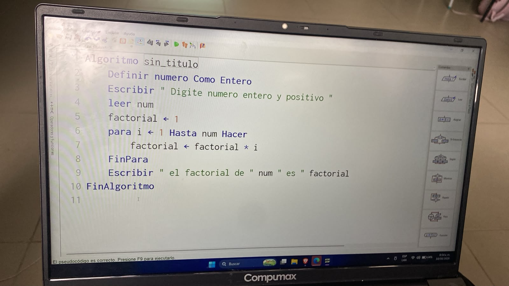

# ALGORITMOS PARA
Un ejercicio para en PSeInt es un problema de programación que se resuelve usando la estructura repetitiva "Para" (o bucle For).Esta estructura sirve para repetir un bloque de código un número exacto y conocido de veces. Utiliza una variable contadora que empieza en un valor inicial, avanza paso a paso hasta llegar a un valor final.Puedes encontrar colecciones de práctica con más de 150 Ejercicios Resueltos de PSeInt o consultar la teoría oficial sobre el Comando Para en Pseint.

## Fotos de algoritmos Para

