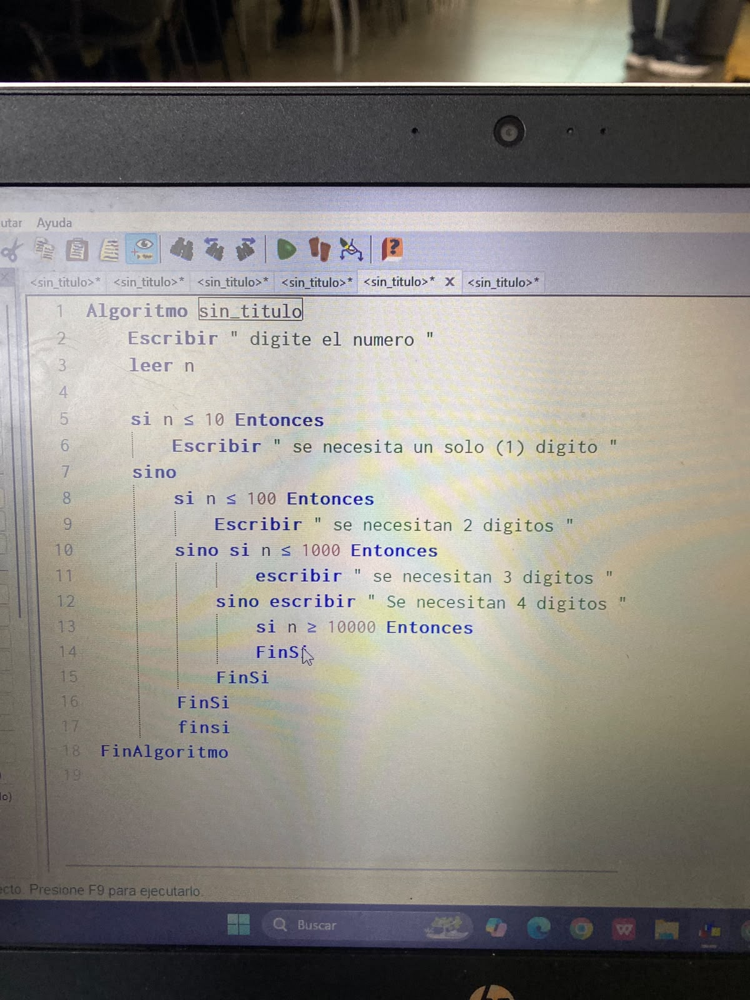
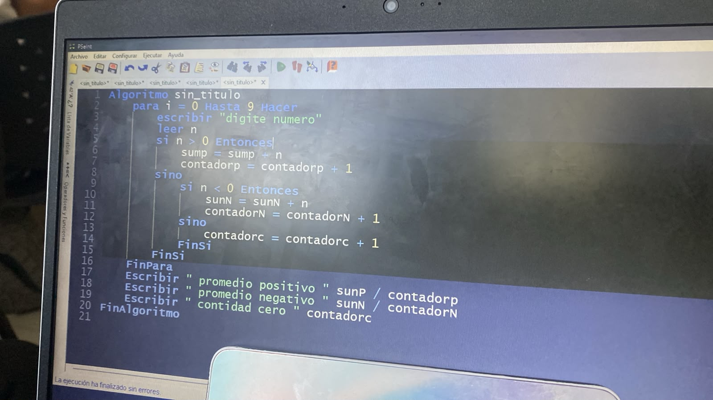
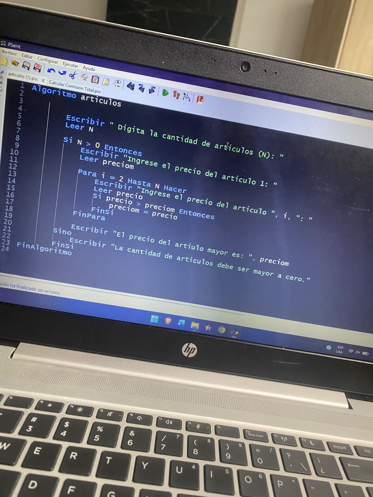

# ALGORITMOS

## ¿ QUÉ ES ? 

. Un algoritmo es el fundamento de la informática, un conjunto formal de instrucciones diseñadas para transformar datos de entrada (input) en un resultado deseado (output). No es código en sí mismo, sino la lógica matemática y conceptual que existe antes de escribir el código en cualquier lenguaje de programación.

## Los 3 Componentes de un Algoritmo 
Todo algoritmo estructurado se divide en tres etapas claras:
- Entrada (Input): La información o datos brutos que el algoritmo necesita para empezar a trabajar.
- Proceso: La serie de pasos lógicos, cálculos y decisiones que se aplican a los datos de entrada.
Salida (Output): El resultado final u objetivo que se obtiene tras procesar la información.

## Características Técnicas Requeridas: 

Para que una secuencia de pasos sea considerada un algoritmo en informática, debe cumplir estrictamente con lo siguiente:

- Finitud: Debe terminar en algún momento; no puede quedarse en un bucle infinito.
- Definición (Precisión): Si se ejecuta el algoritmo dos veces con los mismos datos de entrada, se debe obtener exactamente el mismo resultado.
- Efectividad: Cada paso debe ser lo suficientemente simple como para poder realizarse en un tiempo razonable.
- Legibilidad: Debe ser claro para que cualquier programador pueda entenderlo y traducirlo a código.

## ¿Cómo se representa un Algoritmo?

Antes de programar en la computadora, los desarrolladores usan tres herramientas principales para diseñar los algoritmos:

[Diagrama de Flujo]  -->  [Pseudocódigo]  -->  [Código Final]
   (Visual/Gráfico)          (Texto simple)       (Python, C++, etc.)

1. Texto Narrativo: Explicar el proceso en lenguaje humano natural paso a paso (suele ser demasiado ambiguo para la programación).

2.Pseudocódigo: Un lenguaje intermedio entre el humano y el de las máquinas. Usa palabras clave como "Si", "Entonces", "Mientras", "Repetir".

3. Diagramas de Flujo: Representaciones gráficas que usan figuras geométricas (óvalos para el inicio/fin, rectángulos para procesos, rombos para decisiones).

## Ejercicios dados en clase: si / sino

Inicio

    Leer NúmeroA, NúmeroB, NúmeroC
    Si NúmeroA > NúmeroB y NúmeroA > NúmeroC Entonces
        Escribir "El mayor es NúmeroA"
    Sino, Si NúmeroB > NúmeroA y NúmeroB > NúmeroC Entonces
        Escribir "El mayor es NúmeroB"
    Sino
        Escribir "El mayor es NúmeroC"
Fin

Algoritmo Numerosprimos
	Escribir " digite numero "
	leer num
	para j <- 2 Hasta num Hacer 
		i = 1 
		d = 0 
	Mientras i <= j
		si ( j mod i = 0 )
			d = d + 1
		FinSi
		i = i + 1
	FinMientras
	si d <= 2 Entonces
		primo = primo + 1
		Escribir j
	FinSi
FinPara
Escribir " hay " primo " primos "
	
FinAlgoritmo

