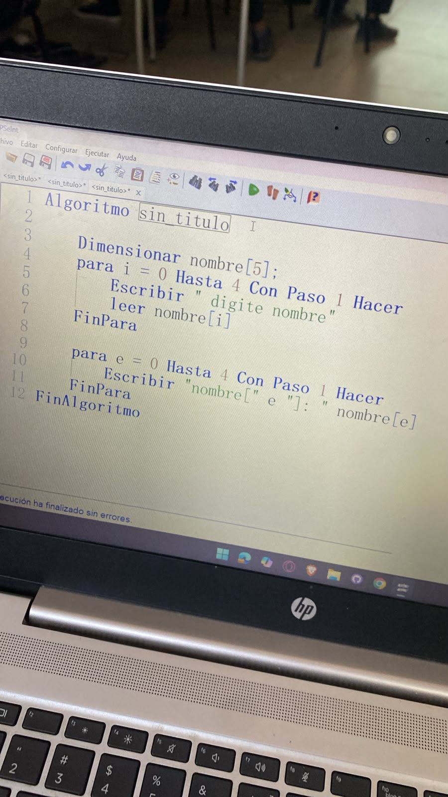
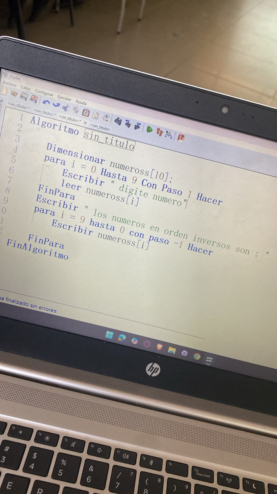
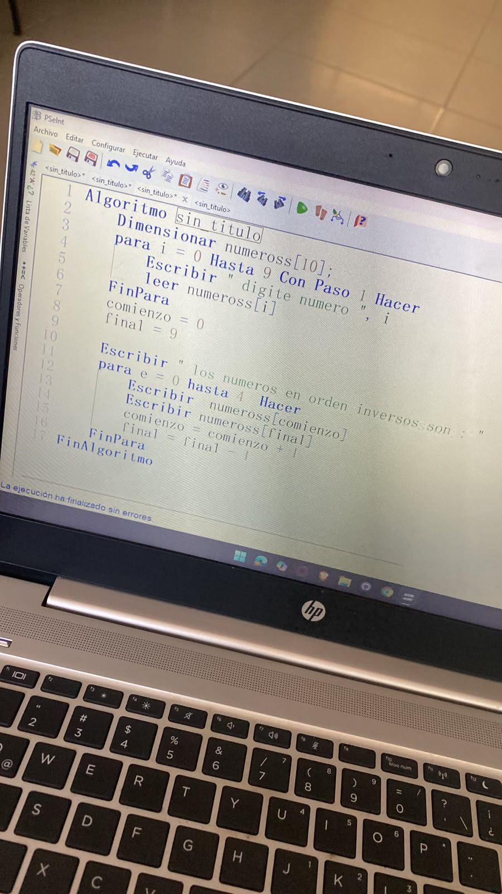
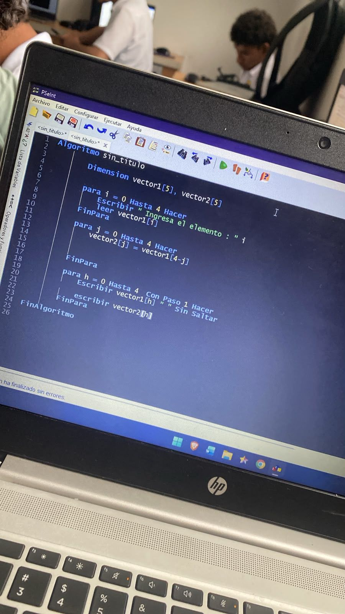
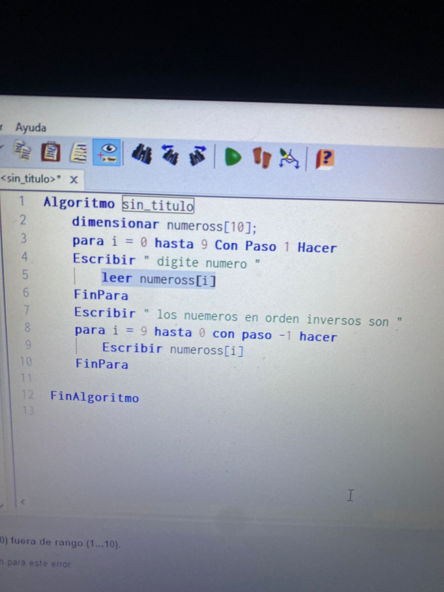

# Algoritmos con dimensiones ( vectores y matrices)

## ¿Qué es Dimensionar ?
Los arreglos son estructura de datos homogéneas (todos los datos son del mismo tipo) que permiten almacenar un determinado número de datos bajo un mismo identificador, para luego referirse a los mismos utilizando uno o más subíndices. Los arreglos pueden pensarse como vectores, matrices, etc.

Para crear un arreglo en PSeInt se utiliza la palabra clave Dimension, seguido del nombre del arreglo (identificador) y su tamaño (numero de subíndices) entre corchetes [].

## Dimension identificador [tamaño];

En PSeInt los subíndices (posiciones) de los arreglos empiezan desde 1.

Ejemplo no. 1

Crear un arreglo llamado numeros que almacene los siguientes datos: 20, 14, 8, 0, 5, 19, 4,9,34, y 23.

Algoritmo ejemplo

	definir M como entero
	dimension vNumero[10] 
	
	Limpiar Pantalla
	
	vNumero[1]<-20
	vNumero[2]<-14
	vNumero[3]<-8
	vNumero[4]<-0
	vNumero[5]<-5
	vNumero[6]<-19
	vNumero[7]<-4
	vNumero[8]<-9
	vNumero[9]<-34
	vNumero[10]<-23

## ¿Qué es un Vector? 
 Es un arreglo de 1 Dimension. Guarda una lista.
 * Ejemplo: numeros[10]

## ¿Qué es una Matriz?
Es un arreglo de 2 Dimensiones. Guarda tabla con filas y columnas.
* Ejemplo: matriz[3,3].

# Tipos de operaciones comunes :
- Llenar el vector
- Mostrar el Vector
- Mostrar el revés (como tu código)
- Sumar elementos
- Buscar el mayor/menor

## Ejemplo de codigo :

