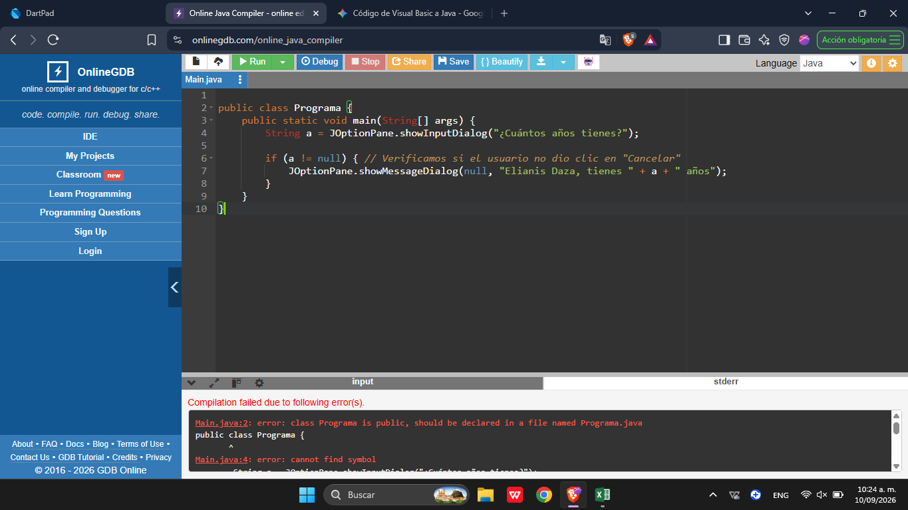

# PROGRAMACION ORIENTADA EN OBJETOS: EJERCICIOS EN CLASE

La **Programación Orientada a Objetos (POO)** es un paradigma de programación que permite organizar el código mediante **objetos y clases**. Cada objeto representa una entidad que puede tener características y comportamientos. La POO facilita la organización, reutilización y mantenimiento del código, permitiendo desarrollar programas de una manera más estructurada.

## EJERCICIOS TRABAJADOS

- ###### En texto 
1. Visual basic
Sub programa()
   a = InputBox("¿ Cuantos años tienes?")
   MsgBox (" Elianis Daza, tienes " & a & " años")

End Sub

2. DartPad
void main() {
   String a = "18" ;
   String e = "vive en el barrio el bosque" ;
   print( " Elianis Daza, tiene " + a + " Años, y " + e );
}
3. Java
public class Programa {
    public static void main(String[] args) {
        String a = JOptionPane.showInputDialog("¿Cuántos años tienes?");
        
        if (a != null) { // Verificamos si el usuario no dio clic en "Cancelar"
            JOptionPane.showMessageDialog(null, "Elianis Daza, tienes " + a + " años");
        }
    }
}
--- 
- ###### En imágenes
1. 
2. 
3. 
---
### CONCLUSIÓN

Este ejercicio permitió comprender que, aunque los lenguajes de programación pueden realizar la misma tarea, cada uno utiliza una sintaxis diferente. También se aprendió la diferencia entre concatenación, que une textos y variables mediante operadores como + o &, e interpolación, que permite insertar directamente una variable dentro de una cadena. Esto ayuda a entender que un código que funciona en Dart o Visual Basic no necesariamente funcionará igual en Java, ya que cada lenguaje tiene sus propias reglas de escritura y sintaxis.