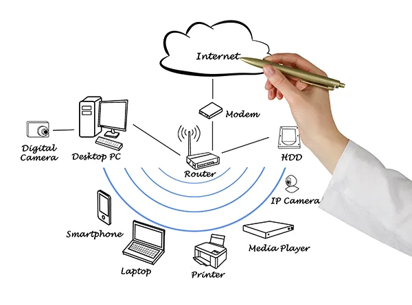

# 🌐 ¿Cómo funciona Internet?

## 📌 Introducción

Internet es una infraestructura mundial formada por una enorme cantidad de redes y dispositivos conectados entre sí. Permite que computadores, teléfonos, servidores y otros dispositivos intercambien información utilizando diferentes protocolos de comunicación.

Aunque normalmente usamos Internet para navegar por páginas web, enviar mensajes, ver videos o utilizar aplicaciones, detrás de estas acciones existe un conjunto de tecnologías que permiten que los datos lleguen desde un dispositivo hasta otro.

Es importante diferenciar **Internet** de **la Web**. Internet es la infraestructura que conecta las redes y dispositivos, mientras que la Web es uno de los servicios que funciona sobre esa infraestructura.

---

## 💻 1. ¿Qué es Internet?

Internet puede entenderse como una **red de redes**. Está formada por diferentes redes que se encuentran conectadas mediante dispositivos de comunicación, como routers.

Los proveedores de servicios de Internet (ISP) conectan las redes de los usuarios con otras redes y permiten que los datos puedan desplazarse hasta su destino.

Un ejemplo sencillo sería:

```text
Computador
     ↓
Router
     ↓
Proveedor de Internet (ISP)
     ↓
Otras redes
     ↓
Servidor
```

La información puede atravesar diferentes redes y dispositivos antes de llegar a su destino.

---

## 🌐 2. Internet y la Web no son lo mismo

Estos dos conceptos suelen confundirse.

**Internet:** es la infraestructura que permite conectar diferentes redes y dispositivos.

**Web (World Wide Web):** es un servicio que funciona utilizando Internet y permite acceder a páginas y recursos mediante navegadores web.

Además de la Web, Internet permite utilizar otros servicios, como el correo electrónico y diferentes sistemas de comunicación.

---

## 🖥️ 3. Clientes y servidores

En la Web existen principalmente dos participantes:

### Cliente

Es el dispositivo o programa que solicita información. Por ejemplo, cuando una persona utiliza un navegador para entrar a una página web, su computador o teléfono funciona como cliente.

### Servidor

Es el computador o sistema que almacena y proporciona recursos, como páginas web, imágenes, archivos o aplicaciones.

El proceso básico puede representarse así:

```text
CLIENTE
   │
   │ Solicitud
   ↓
SERVIDOR
   │
   │ Respuesta
   ↓
CLIENTE
```

Este modelo se conoce como **cliente-servidor**.

---

## 🔢 4. ¿Qué es una dirección IP?

Una dirección IP es un identificador utilizado para localizar un dispositivo dentro de una red.

En IPv4, una dirección puede tener una forma como:

```text
192.168.1.10
```

Las direcciones IP permiten que los dispositivos y routers puedan identificar hacia dónde deben dirigirse los datos.

Los routers utilizan información de las direcciones IP para determinar cómo enviar los datos hacia otras redes.

---

## 🔎 5. ¿Qué es el DNS?

Recordar direcciones IP sería complicado para las personas. Por eso existe el **DNS (Domain Name System)**.

El DNS permite relacionar nombres de dominio fáciles de recordar con direcciones IP.

Por ejemplo:

```text
Nombre de dominio
      ↓
ejemplo.com
      ↓
Dirección IP
```

Cuando escribimos un dominio en el navegador, este necesita conocer la dirección correspondiente para poder comunicarse con el servidor adecuado.

Por esta razón, el DNS puede compararse con una especie de directorio de nombres para Internet.

---

## 📦 6. ¿Cómo viajan los datos?

La información que enviamos a través de Internet no necesariamente viaja como un único bloque.

Los datos pueden dividirse en pequeñas unidades llamadas **paquetes**.

Cada paquete contiene información necesaria para poder ser transportado, además de una parte de los datos que se quieren transmitir.

Una representación simplificada sería:

```text
Información original
        ↓
 ┌────┬────┬────┬────┐
 │ P1 │ P2 │ P3 │ P4 │
 └────┴────┴────┴────┘
        ↓
     Internet
        ↓
 ┌────┬────┬────┬────┐
 │ P1 │ P2 │ P3 │ P4 │
 └────┴────┴────┴────┘
        ↓
Información reconstruida
```

Los paquetes pueden recorrer diferentes rutas y posteriormente ser organizados para reconstruir la información.

---

## 🔗 7. ¿Qué es TCP/IP?

**TCP/IP** hace referencia a un conjunto de protocolos fundamentales utilizados para la comunicación en Internet.

### IP — Internet Protocol

Se encarga principalmente del direccionamiento y del envío de paquetes entre redes.

### TCP — Transmission Control Protocol

Proporciona mecanismos para que la comunicación sea confiable, ayudando a gestionar la transmisión de los datos.

En conjunto, estos protocolos permiten que la información pueda viajar entre diferentes redes.

---

## 🌍 8. ¿Qué ocurre cuando escribimos una dirección web?

Cuando escribimos una dirección web en el navegador ocurre una serie de pasos.

Por ejemplo:

```text
https://ejemplo.com
```

De forma simplificada:

1. El navegador identifica el dominio.
2. Se consulta el DNS para obtener la dirección IP correspondiente.
3. El navegador realiza una solicitud al servidor.
4. Los datos se transmiten mediante las redes utilizando los protocolos correspondientes.
5. El servidor procesa la solicitud.
6. El servidor envía una respuesta.
7. El navegador recibe los recursos necesarios.
8. Finalmente, el navegador construye y muestra la página.

---

## 📡 9. ¿Qué es HTTP?

**HTTP (Hypertext Transfer Protocol)** es un protocolo utilizado para la comunicación entre clientes y servidores web.

El navegador puede realizar una **solicitud (request)** y el servidor puede devolver una **respuesta (response)**.

Un ejemplo sencillo:

```text
Navegador
   │
   │ HTTP Request
   ↓
Servidor
   │
   │ HTTP Response
   ↓
Navegador
```

HTTP funciona siguiendo un modelo cliente-servidor y se utiliza para obtener recursos como documentos HTML, imágenes y otros contenidos.

---

## 🔒 10. ¿Qué es HTTPS?

HTTPS es la versión segura de HTTP.

Utiliza **TLS (Transport Layer Security)** para proteger la comunicación entre el cliente y el servidor mediante cifrado.

Por eso las direcciones web seguras normalmente comienzan con:

```text
https://
```

El uso de HTTPS ayuda a proteger la información mientras se transmite entre el navegador y el servidor.

---

## 🧩 11. ¿Qué elementos intervienen?

Para que una página web pueda funcionar intervienen diferentes componentes:

* 👤 **Cliente:** solicita información.
* 🖥️ **Servidor:** proporciona recursos.
* 🌐 **Internet:** conecta diferentes redes.
* 🔢 **Dirección IP:** identifica una ubicación dentro de una red.
* 🔎 **DNS:** relaciona dominios con direcciones IP.
* 📦 **Paquetes:** permiten transportar partes de la información.
* 🔗 **TCP/IP:** proporciona protocolos fundamentales de comunicación.
* 📡 **HTTP/HTTPS:** permite la comunicación entre navegadores y servidores.
* 🌍 **URL:** identifica la ubicación de un recurso en la Web.

---

## 🧠 12. Ejemplo completo

Supongamos que una persona quiere entrar a una página web.

```text
1. El usuario escribe una URL
             ↓
2. El navegador identifica el dominio
             ↓
3. DNS encuentra la dirección IP
             ↓
4. El navegador se comunica con el servidor
             ↓
5. Se realiza una solicitud HTTP/HTTPS
             ↓
6. El servidor procesa la solicitud
             ↓
7. El servidor envía los recursos
             ↓
8. Los datos llegan en paquetes
             ↓
9. El navegador procesa los recursos
             ↓
10. La página aparece en pantalla
```

Este proceso ocurre en muy poco tiempo, aunque detrás de una acción tan sencilla intervienen diferentes protocolos, servidores y redes.

---

## ⚙️ 13. ¿Por qué es importante conocer cómo funciona Internet?

Comprender el funcionamiento básico de Internet permite entender mejor tecnologías que utilizamos diariamente.

También sirve como base para estudiar temas más avanzados como:

* Desarrollo web.
* Redes informáticas.
* Ciberseguridad.
* Administración de servidores.
* Computación en la nube.
* Bases de datos.
* Protocolos de comunicación.

Por esta razón, conocer Internet es una base importante para cualquier persona que quiera continuar aprendiendo informática.

---

## ✅ Conclusión

Internet es una infraestructura formada por una gran cantidad de redes y dispositivos que se comunican mediante protocolos.

Cuando una persona visita una página web, intervienen diferentes elementos: el dispositivo cliente, el servidor, las direcciones IP, el DNS, los paquetes de datos y protocolos como TCP/IP y HTTP.

Comprender este proceso permite tener una visión más clara de lo que ocurre detrás de las aplicaciones y páginas web que utilizamos diariamente y proporciona una base para continuar estudiando redes, desarrollo web y otras áreas de la informática.

---
