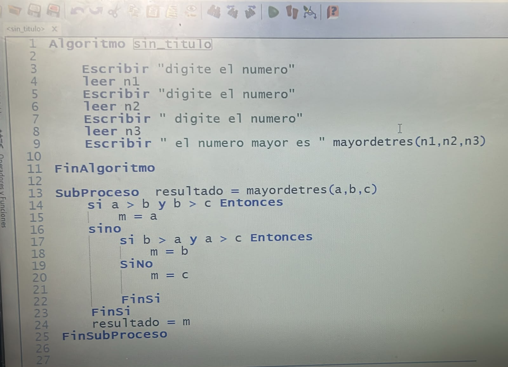
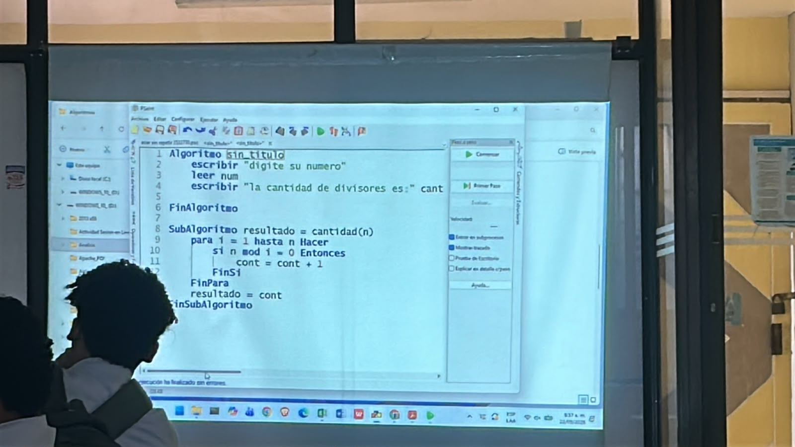
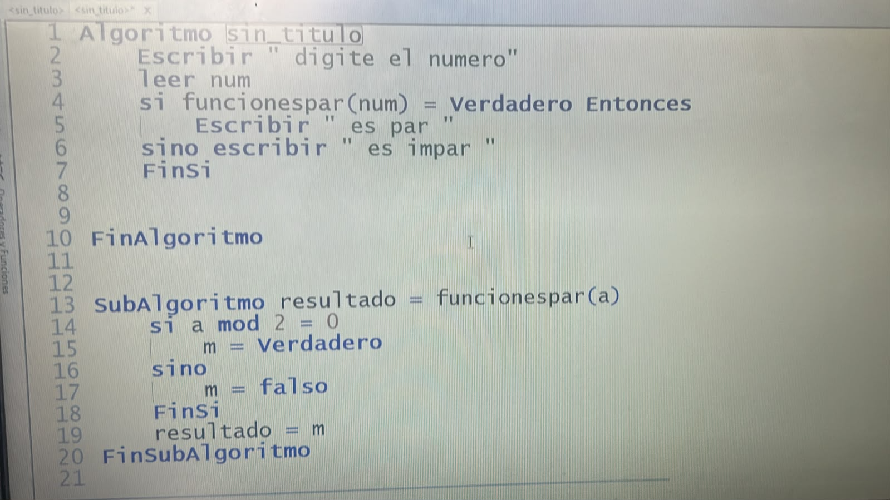

# Subproceso y subalgoritmo

## Introducción

En programación, cuando un problema tiene muchas instrucciones, puede ser complicado escribir todo en un solo bloque de código. Para facilitar este trabajo, los algoritmos se pueden dividir en partes más pequeñas que se encargan de realizar tareas específicas.

Los **subprocesos y subalgoritmos** permiten organizar mejor las instrucciones de un programa. Aunque estos conceptos se encuentran principalmente en el trabajo con algoritmos y pseudocódigo, también existen estructuras similares en los diferentes lenguajes de programación.

---

## ¿Qué es un subalgoritmo?

Un **subalgoritmo** es una parte de un algoritmo principal que se utiliza para resolver una tarea determinada.

La idea es dividir un problema grande en varias partes más sencillas. Cada parte realiza una función específica y, al combinarse, permite solucionar el problema completo.

Por ejemplo, un programa para una tienda podría dividirse en diferentes subalgoritmos:

* Registrar productos.
* Calcular el precio.
* Aplicar descuentos.
* Calcular el total.
* Mostrar la factura.

De esta forma, cada tarea queda separada y el algoritmo principal es más fácil de entender.

---

## ¿Qué es un subproceso?

Un **subproceso** es un conjunto de instrucciones que realiza una tarea específica dentro de un algoritmo.

En PSeInt, los subprocesos se pueden declarar utilizando la palabra `SubProceso`. Después pueden ser llamados desde el algoritmo principal cuando sea necesario.

Un ejemplo sencillo es:

```text
SubProceso Saludar
    Escribir "Hola, bienvenido"
FinSubProceso
```

El subproceso llamado `Saludar` contiene una instrucción que muestra un mensaje.

Posteriormente, puede ser utilizado desde el algoritmo:

```text
Algoritmo Ejemplo
    Saludar
FinAlgoritmo
```

Esto permite utilizar nuevamente la misma tarea sin tener que escribir las instrucciones desde cero.

---

## ¿Para qué sirven?

Los subprocesos y subalgoritmos sirven principalmente para **organizar y dividir un programa**.

Entre sus principales usos están:

* Dividir problemas grandes en tareas más pequeñas.
* Evitar repetir las mismas instrucciones.
* Facilitar la lectura del código.
* Hacer más sencillo encontrar errores.
* Facilitar las modificaciones del programa.
* Reutilizar determinadas instrucciones.

La programación modular utiliza esta idea para dividir un programa en componentes más pequeños y manejables.

---

## Parámetros

Un subproceso también puede recibir información para poder realizar su tarea. Estos datos se conocen como **parámetros**.

Por ejemplo:

```text
SubProceso MostrarNombre(nombre)
    Escribir "Hola ", nombre
FinSubProceso
```

Al utilizarlo:

```text
MostrarNombre("Carlos")
```

El valor `"Carlos"` se envía al parámetro `nombre`.

Los parámetros permiten que un mismo subproceso pueda trabajar con diferentes datos.

---

## Subproceso y función

Los subprocesos y las funciones tienen algunas similitudes, pero no son exactamente iguales.

Un **subproceso** se utiliza principalmente para ejecutar una serie de instrucciones o realizar una acción.

Una **función**, además de realizar instrucciones, normalmente devuelve un valor que puede ser utilizado posteriormente.

Por ejemplo:

```text
SubProceso MostrarMensaje
    Escribir "Hola"
FinSubProceso
```

Este subproceso muestra un mensaje, pero no devuelve un resultado.

Una función podría ser:

```text
Funcion resultado <- Sumar(a, b)
    resultado <- a + b
FinFuncion
```

En este caso, la función devuelve el resultado de sumar `a` y `b`.

---

## ¿Cómo se llaman en otros lenguajes de programación?

El concepto de dividir un programa en bloques de código existe en muchos lenguajes, pero el nombre puede cambiar.

| Lenguaje     | Nombre utilizado     |
| ------------ | -------------------- |
| PSeInt       | SubProceso / Función |
| Python       | Función              |
| JavaScript   | Función              |
| Java         | Método               |
| C#           | Método               |
| C            | Función              |
| C++          | Función              |
| Visual Basic | Sub / Function       |

### Python

En Python se utiliza `def` para definir una función:

```python
def saludar():
    print("Hola")
```

Las funciones de Python pueden recibir parámetros y devolver valores.

### JavaScript

JavaScript utiliza funciones:

```javascript
function saludar() {
    console.log("Hola");
}
```

Una función puede ser llamada desde otra parte del programa cuando se necesite.

### Java

En Java se utiliza normalmente el término **método**:

```java
public void saludar() {
    System.out.println("Hola");
}
```

Los métodos forman parte de las clases y contienen las instrucciones que se ejecutan cuando son llamados.

### C#

En C# también se utiliza el término **método**:

```csharp
void Saludar()
{
    Console.WriteLine("Hola");
}
```

Un método puede recibir parámetros y también puede devolver un resultado.

---

## Diferencia entre los conceptos

Aunque los términos están relacionados, existe una diferencia en la forma en que se utilizan.

**Subalgoritmo:** es una parte de un algoritmo que resuelve una tarea específica.

**Subproceso:** es una estructura utilizada en pseudocódigo, como en PSeInt, para agrupar instrucciones que realizan una tarea.

**Función:** es una estructura que normalmente realiza una operación y devuelve un valor.

**Método:** es el término utilizado en lenguajes como Java y C# para una operación definida dentro de una clase u otra estructura.

Todos tienen en común la división de un programa en partes más pequeñas.

---

## Ejemplo práctico

Supongamos que se quiere crear un programa que calcule el precio final de un producto.

El problema puede dividirse en diferentes tareas:

```text
Algoritmo Compra

    Leer precio
    Leer descuento

    CalcularDescuento(precio, descuento)
    MostrarResultado()

FinAlgoritmo
```

De esta manera, cada parte del programa tiene una responsabilidad específica.

En lugar de tener todas las instrucciones mezcladas, se pueden separar las operaciones relacionadas con el cálculo, la validación y la presentación de los resultados.

---

## Ventajas

Los subprocesos y subalgoritmos ofrecen varias ventajas:

1. **Organización:** permiten mantener las instrucciones ordenadas.
2. **Reutilización:** una misma tarea puede utilizarse varias veces.
3. **Mantenimiento:** los cambios pueden realizarse en una parte específica del programa.
4. **Comprensión:** el código puede ser más fácil de leer.
5. **Detección de errores:** facilita encontrar en qué parte se encuentra un problema.
6. **División del problema:** permite trabajar con problemas grandes mediante tareas más pequeñas.

---

## Desventajas

También pueden presentarse algunas dificultades:

* Si se crean demasiados subprocesos, el programa puede resultar difícil de seguir.
* Una mala organización puede hacer que el código sea más complicado.
* Es necesario comprender correctamente el uso de parámetros.
* Los diferentes lenguajes tienen reglas distintas para crear y utilizar estas estructuras.

---

## Conclusión

Los subprocesos y subalgoritmos son herramientas utilizadas para dividir un problema de programación en partes más pequeñas. Cada parte puede encargarse de una tarea específica, lo que permite organizar mejor las instrucciones y facilitar el desarrollo del programa.

En PSeInt se utiliza principalmente el término **SubProceso**, mientras que en otros lenguajes se utilizan términos como **función**, **procedimiento** o **método**. Aunque existen diferencias entre ellos, todos buscan facilitar la organización y reutilización del código.

Comprender estos conceptos es importante para pasar de algoritmos y pseudocódigo a lenguajes de programación, ya que la mayoría de los lenguajes modernos utilizan alguna forma de dividir el código en bloques que realizan tareas específicas.

---
imagenes: 


