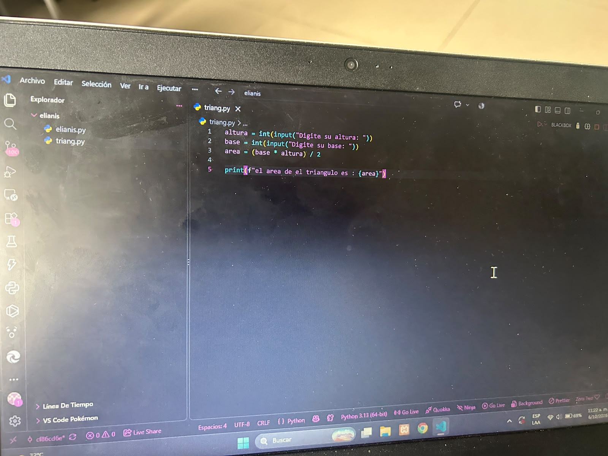
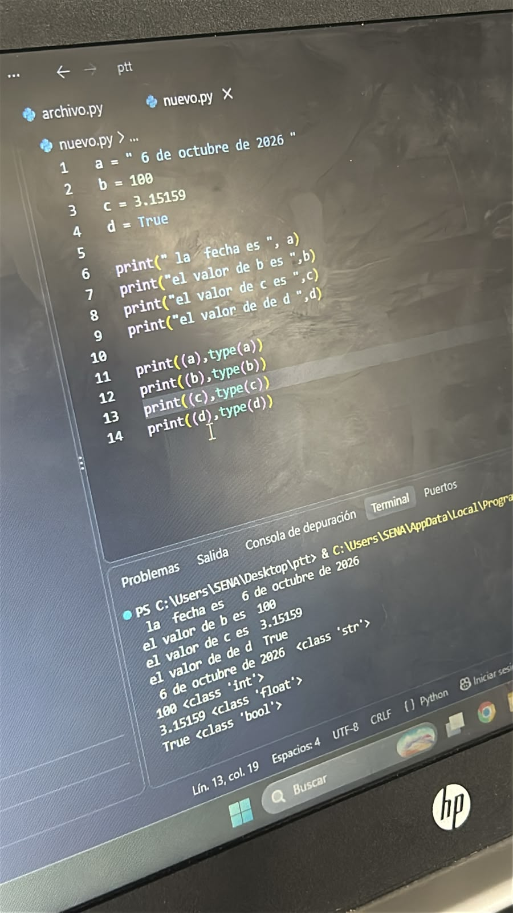
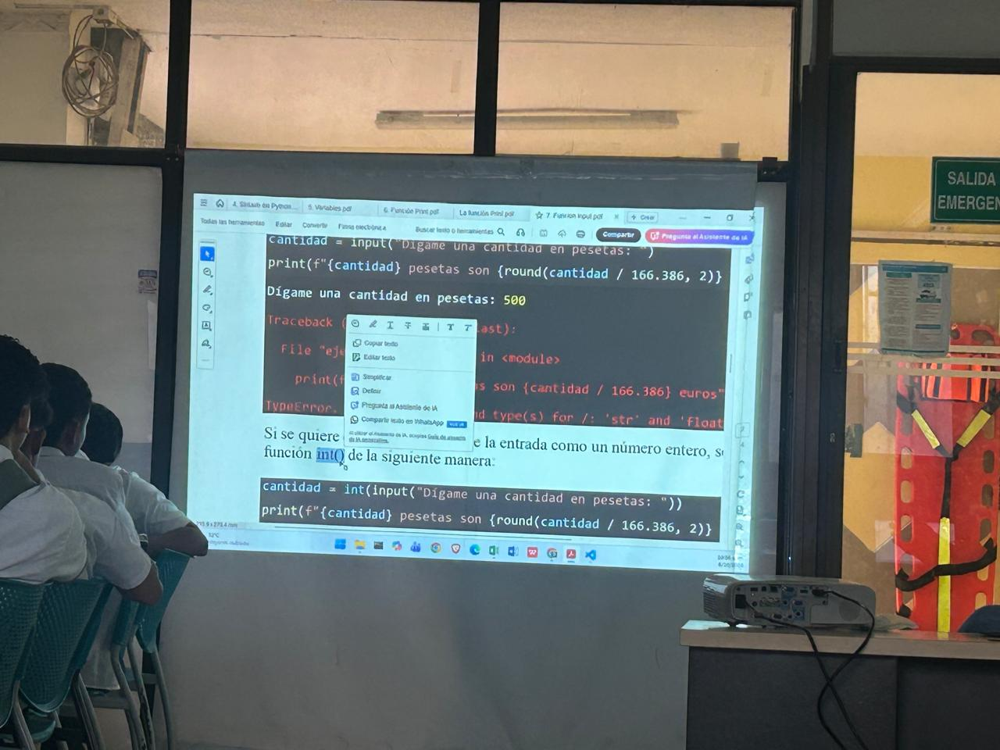
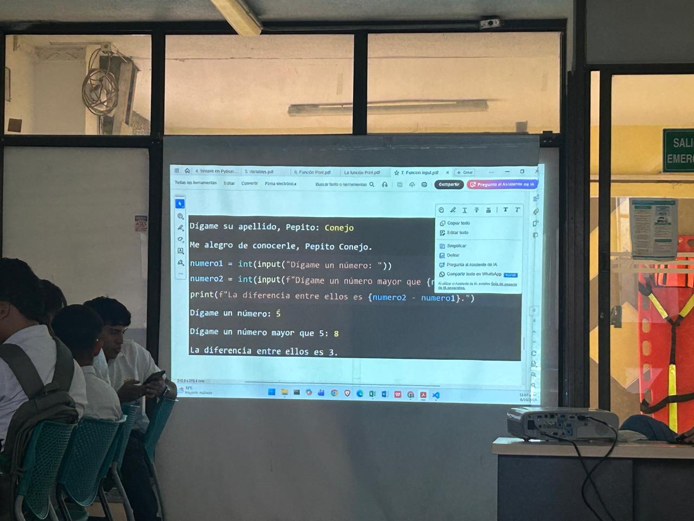

# Python

## Introducción

Python es un lenguaje de programación de alto nivel, interpretado y de propósito general. Se caracteriza por tener una sintaxis sencilla y fácil de leer, por lo que es utilizado tanto por personas que están aprendiendo programación como por desarrolladores con experiencia. (Python documentation)

## ¿Qué es Python?

Python es un lenguaje creado a finales de los años 80 por Guido van Rossum. Su desarrollo comenzó en los Países Bajos y posteriormente fue publicado para que otras personas pudieran utilizarlo y contribuir a su evolución. (Wiki Python)

Una de sus principales características es que busca que el código sea claro y fácil de entender. La documentación oficial destaca su sintaxis sencilla, sus estructuras de datos y su capacidad para desarrollar diferentes tipos de aplicaciones. (Python documentation)

## Características principales

- **Fácil de leer:** utiliza una sintaxis relativamente sencilla.
- **Interpretado:** los programas pueden ejecutarse mediante el intérprete de Python.
- **Multiplataforma:** puede utilizarse en diferentes sistemas operativos.
- **Orientado a objetos:** permite trabajar con clases y objetos.
- **Biblioteca estándar:** incluye muchas herramientas que permiten realizar diferentes tareas.
- **Código reutilizable:** permite organizar programas mediante módulos y paquetes. (Python documentation)

## ¿Para qué se utiliza?

Python puede utilizarse en diferentes áreas de la programación, por ejemplo:

- Desarrollo de aplicaciones.
- Automatización de tareas.
- Desarrollo web.
- Análisis de datos.
- Inteligencia artificial.
- Creación de scripts.
- Educación y aprendizaje de programación.

La documentación oficial señala que Python puede utilizarse para una gran variedad de problemas y cuenta con una amplia biblioteca estándar. (Python documentation)

## Ventajas de Python

- Su sintaxis es sencilla y legible.
- Es gratuito y de código abierto.
- Tiene una gran biblioteca estándar.
- Permite desarrollar diferentes tipos de programas.
- Cuenta con una amplia comunidad de usuarios y desarrolladores.

## Imagenes





---

## Ejemplo básico

Un programa sencillo en Python puede mostrar un mensaje en pantalla:

```python
print("Hola, mundo")

El resultado sería:

Hola, mundo

Ejercicio práctico
Problema
Realizar un programa en Python que solicite el nombre de una persona y su edad, y posteriormente muestre un mensaje indicando su nombre y edad.

Código
nombre = input("Ingrese su nombre: ")
edad = int(input("Ingrese su edad: "))

print("Hola", nombre)
print("Tienes", edad, "años")

Ejemplo de ejecución
Ingrese su nombre: Carlos
Ingrese su edad: 18

Hola Carlos
Tienes 18 años

Explicación
input() permite recibir información del usuario.

nombre almacena el nombre ingresado.

edad almacena la edad.

int() convierte el dato ingresado en un número entero.

print() muestra información en pantalla.

## imagenes
